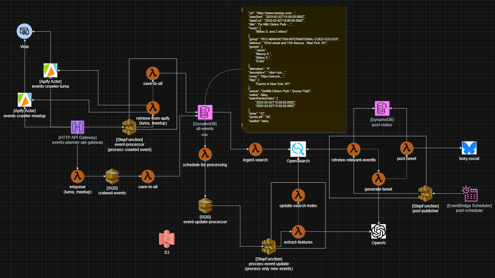

# Events Ingestion and Ranking Data Pipeline

## Abstract

**Events Planner SST** is a cloud-native, serverless solution for end-to-end event data management. Leveraging [SST](https://sst.dev/) and AWS, it ingests events from diverse sources—including Apify crawlers via webhooks—enriches and scores them, and supports hybrid search and automated publishing. The platform emphasizes extensibility, reliability, and analytics, making it suitable for both production operations and research-driven workflows.

---

## System Overview

### System Design

The following diagram illustrates the end-to-end system architecture, showing how event data flows from ingestion to enrichment, search, and publishing:



**Description:**  
Events Planner SST uses a modular, serverless architecture on AWS. Event data is ingested via API Gateway and crawlers (Apify), processed by Lambda functions, and stored in DynamoDB. Events are enriched, scored, and indexed in OpenSearch for advanced search and analytics. Automated publishing to external platforms (Bluesky, Twitter) is managed via Lambda and Step Functions. The system supports extensible integrations (OpenAI, Apify), asynchronous processing (SQS), and secure secrets management (SST Secrets, DynamoDB Authorizer).  

### Software Architecture

- **Event Ingestion Pipeline**
  - **API Gateway**: Entry point for event data (external APIs, crawlers).
  - **Lambda Functions**: Handle ingest, update, queueing, indexing, and authorization.
  - **DynamoDB**: Stores raw and processed event data.

- **Processing & Enrichment**
  - **Functions**: Enrich events (e.g., scoring, deduplication, normalization).
  - **Queues**: Asynchronous processing for scalability.
  - **Search Indexers**: Index events in OpenSearch for fast retrieval.

- **Storage**
  - **all-events**: Master event dataset.
  - **upcoming-events**: Filtered, time-sensitive events.
  - **post-status**: Tracks publishing state.

- **OpenSearch Integration**
  - **Queries**: Full-text, hybrid, and ranking queries.
  - **Dashboards**: Visualize event metrics and search performance.
  - **Ranking**: Function scores, heuristics, and hybrid pipelines.

- **External Integrations**
  - **Apify**: Event crawling and dataset ingestion.
  - **OpenAI**: Enrichment, scoring, and semantic search.
  - **Bluesky**: Automated event publishing.

- **SST Deployment Framework**
  - Infrastructure-as-code for AWS resources, Lambda layers, secrets, and CI/CD.

---

## Repository Layout

```
├── src/
│   ├── functions/      # Lambda functions: ingest, update, queue, index, auth
│   ├── services/       # Integrations: Apify, OpenAI, OpenSearch, Bluesky
│   ├── storage/        # Storage logic: all-events, upcoming-events, post-status
│   ├── types/          # TypeScript types for events, context, etc.
│   └── utils/          # Utility functions
├── infra/              # SST infrastructure setup (API, DynamoDB, Lambda, etc.)
├── layers/             # Custom Lambda layers (sharp, datasets)
├── analysis/           # Jupyter notebooks for research, ranking, enrichment
├── docs/               # Design diagrams (see design.png)
├── task/               # Scripts for data ops, ingestion, publishing
├── test/               # Vitest unit/integration tests
├── pkg/                # Custom packages (datasets, dspy)
├── sst.config.ts       # SST configuration
├── tsconfig.json       # TypeScript config
├── vitest.config.ts    # Vitest config
├── package.json        # Project dependencies
├── .env                # Environment variables
```

---

## Setup & Prerequisites

### 1. Node, PNPM, SST

- **Node.js**: v18+
- **PNPM**: `npm install -g pnpm`
- **SST**: `pnpm add -D sst`

### 2. Python (Analysis Notebooks)

- **Conda**: [Miniconda](https://docs.conda.io/en/latest/miniconda.html)
- **PyTorch**: `conda install pytorch torchvision torchaudio -c pytorch`
- **Jupyter**: `conda install jupyterlab`

### 3. AWS CLI & Profile

- [AWS CLI](https://docs.aws.amazon.com/cli/latest/userguide/getting-started-install.html)
- Configure profile: `aws configure --profile <your-profile>`

### 4. Required Secrets

- **SST Secrets**: Store tokens for Events, Notion, Apify, OpenAI, Bluesky.
- **DynamoDB Authorizer Table**: Used for secret management and Lambda authorization.

---

## Secrets Management

### SST Secrets

Use SST's [Secret](https://docs.sst.dev/resources/secret) resource to manage sensitive tokens:

```ts
// infra/secrets.ts
import { Secret } from "sst/constructs";
export const EventsToken = new Secret("EventsToken");
export const NotionToken = new Secret("NotionToken");
export const ApifyToken = new Secret("ApifyToken");
export const OpenAIToken = new Secret("OpenAIToken");
export const BskyToken = new Secret("BskyToken");
```

### DynamoDB Authorizer Table

Secrets are referenced by Lambdas via environment variables and validated against the authorizer table for secure access.

---

## Deployment & Testing

### Deploying

```bash
pnpm install
sst deploy --stage prod
```

### Local Development

```bash
sst dev
```

### Running Tests

```bash
pnpm test
```

Or run specific tests:

```bash
pnpm vitest run src/functions/all-events.ts
```

### Event Ingest Example

```bash
curl -X POST https://<api-gateway-url>/events -d '{"name": "Sample Event", ...}'
```

### OpenSearch Query Example

```bash
curl -X POST https://<opensearch-endpoint>/_search -H 'Content-Type: application/json' -d '{ "query": { ... } }'
```

---

## References

- [OpenSearch CLI Docs](https://opensearch.org/docs/latest/cli/)
- [SST Documentation](https://docs.sst.dev/)
- [AWS CLI Documentation](https://docs.aws.amazon.com/cli/latest/userguide/cli-chap-welcome.html)
