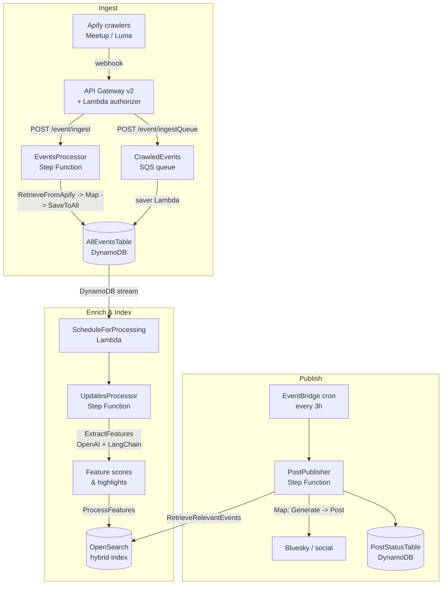

# Events Planner

> Serverless pipeline that ingests events from web crawlers, enriches and ranks them with LLMs, indexes them for hybrid search, and auto-publishes the best ones to social platforms.

[](https://sst.dev/)
[](https://aws.amazon.com/)
[](https://www.typescriptlang.org/)
[](LICENSE)

## Overview

**Events Planner** is a cloud-native, fully serverless platform for end-to-end event data management on AWS.
It solves a concrete problem: events worth attending are scattered across crawlers and aggregators (Meetup,
Luma, and others surfaced through [Apify](https://apify.com/)), arrive in inconsistent shapes, and are hard to
rank by what actually matters to an attendee. The pipeline normalizes that firehose, scores each event with an
LLM-driven feature extractor, makes it searchable, and continuously publishes the highest-ranked upcoming
events to social platforms — with no servers to operate.

The entire stack is defined as infrastructure-as-code with [SST v3](https://sst.dev/) (Pulumi/Ion), so every
Lambda, queue, table, state machine, and schedule is reproducible across stages.

## Architecture

The platform is built from three loosely coupled, event-driven pipelines: **ingest**, **enrich + index**, and
**publish**.


```mermaid
flowchart TD
    subgraph Ingest
        APIFY[Apify crawlers<br/>Meetup / Luma] -->|webhook| APIGW[API Gateway v2<br/>+ Lambda authorizer]
        APIGW -->|POST /event/ingest| SFN1[EventsProcessor<br/>Step Function]
        APIGW -->|POST /event/ingestQueue| SQS[CrawledEvents<br/>SQS queue]
        SFN1 -->|RetrieveFromApify -> Map -> SaveToAll| DDB[(AllEventsTable<br/>DynamoDB)]
        SQS -->|saver Lambda| DDB
    end

    subgraph Enrich & Index
        DDB -->|DynamoDB stream| TRIG[ScheduleForProcessing<br/>Lambda]
        TRIG --> SFN2[UpdatesProcessor<br/>Step Function]
        SFN2 -->|ExtractFeatures<br/>OpenAI + LangChain| SCORE[Feature scores<br/>& highlights]
        SCORE -->|ProcessFeatures| OS[(OpenSearch<br/>hybrid index)]
    end

    subgraph Publish
        CRON[EventBridge cron<br/>every 3h] --> SFN3[PostPublisher<br/>Step Function]
        SFN3 -->|RetrieveRelevantEvents| OS
        SFN3 -->|Map: Generate -> Post| BSKY[Bluesky / social]
        SFN3 --> PST[(PostStatusTable<br/>DynamoDB)]
    end
```

- **Ingest** — Apify crawlers post event payloads to an API Gateway v2 endpoint guarded by a DynamoDB-backed
  Lambda authorizer. Requests are routed straight into a Step Functions state machine (Apify retrieval → `Map`
  fan-out → idempotent upsert into `AllEventsTable`). A parallel SQS-backed route (`/event/ingestQueue`)
  decouples bursty ingestion.
- **Enrich + index** — A DynamoDB stream on `AllEventsTable` triggers the `UpdatesProcessor` state machine.
  `ExtractFeatures` uses OpenAI (via LangChain, structured Zod output) to score each event across attendee-centric
  dimensions (popularity, cost, food/drinks, relevance, …) and produce highlights. `ProcessFeatures` writes the
  enriched document into OpenSearch for full-text and hybrid ranked retrieval.
- **Publish** — An EventBridge cron schedule drives the `PostPublisher` state machine, which retrieves the
  top-ranked upcoming events from OpenSearch, generates a post (with image processing via a Sharp Lambda layer),
  and publishes to Bluesky — tracking dedup/score state in `PostStatusTable` so an event is only re-posted when
  its score materially improves.

## Tech Stack

| Layer | Technology |
| --- | --- |
| Language | TypeScript (ESM, Node.js 18/20 Lambdas) |
| IaC / deploy | SST v3 (Pulumi/Ion), AWS provider |
| Compute | AWS Lambda, AWS Step Functions |
| API | API Gateway v2 + custom Lambda authorizer |
| Storage | DynamoDB (events, upcoming, post-status, auth tokens) |
| Search | OpenSearch (full-text + hybrid ranking) |
| Messaging | Amazon SQS, DynamoDB Streams, EventBridge schedules |
| LLM / enrichment | OpenAI via LangChain, Zod-validated structured output |
| Ingestion | Apify crawlers (Meetup, Luma) via webhooks |
| Publishing | Bluesky (`@atproto/api`), Sharp image layer |
| Research | Python notebooks (DSPy, Cohere, LangChain) for ranking experiments |
| Tooling | Vitest, ESLint, Prettier |

## Features

- **Multi-source ingestion** — webhook and queue-based ingestion from Apify crawlers, normalized into a single
  event model.
- **LLM-based enrichment** — per-event feature scoring and highlight generation with OpenAI + LangChain,
  validated against Zod schemas and reproducible from an optimized extractor config.
- **Hybrid search** — events indexed in OpenSearch for full-text and ranked/hybrid retrieval.
- **Automated publishing** — scheduled Step Functions workflow posts the highest-ranked upcoming events to
  Bluesky, with image processing and re-post deduplication.
- **Secure ingestion** — API Gateway protected by a DynamoDB token-table Lambda authorizer.
- **Resilient workflows** — Step Functions with retries, backoff, and bounded `Map` concurrency throughout.
- **Pure IaC** — every resource defined in SST/Pulumi, deployable per stage with one command.

## Repository Layout

```
.
├── infra/              # SST v3 resource definitions (API, DynamoDB, queues,
│                       #   Step Functions, authorizer, schedules, secrets)
├── src/
│   ├── functions/      # Lambda handlers (ingest, enrich, index, publish, auth)
│   ├── services/       # Integrations: Apify, OpenAI/LangChain, OpenSearch, Bluesky
│   ├── storage/        # DynamoDB access (all-events, upcoming, post-status)
│   ├── types/          # Shared TypeScript domain types
│   └── utils/          # Helpers
├── lib/sst-sfn/        # Step Functions DSL helpers for SST
├── analysis/           # Jupyter notebooks: ranking / enrichment research (DSPy, Cohere)
├── task/               # One-off operational scripts (ingest, publish, cleanup)
├── test/               # Vitest unit / integration tests
├── images/ docs/       # Architecture diagrams
└── sst.config.ts       # SST app entrypoint
```

## Getting Started

### Prerequisites

- Node.js 18+ and [pnpm](https://pnpm.io/) (`npm install -g pnpm`)
- An AWS account with credentials configured (`aws configure`)
- API tokens for the integrations you intend to use (Apify, OpenAI, Bluesky)

### Install

```bash
pnpm install
```

### Configure secrets

Secrets are managed through SST and never committed. Set them per stage:

```bash
pnpm sst secret set OPENAI_API_KEY        <value> --stage prod
pnpm sst secret set APIFY_TOKEN           <value> --stage prod
pnpm sst secret set BSKY_PASSWORD         <value> --stage prod
pnpm sst secret set EVENTS_INGEST_TOKEN   <value> --stage prod
pnpm sst secret set NOTION_TOKEN          <value> --stage prod
```

Runtime configuration (e.g. `OPENSEARCH_URL`, `BSKY_HANDLE`, `ALL_EVENTS_INDEX`,
`POST_PUBLISHER_BATCH_SIZE`, `OPENAI_API_MODEL_NAME`) is supplied via environment variables / `.env`.

### Develop and deploy

```bash
pnpm dev                  # live Lambda dev (sst dev)
pnpm deploy               # sst deploy --stage prod
pnpm test                 # vitest run
pnpm remove               # tear down the stage
```

## Author

**Ilia Zlobin** — Principal Software Engineer

- Portfolio: [iliazlobin.com/portfolio](https://iliazlobin.com/portfolio)
- GitHub: [@iliazlobin](https://github.com/iliazlobin)

## License

[MIT](LICENSE) © 2026 Ilia Zlobin
